# YOLOv7 on Cityscapes with bbox cropping

## Introduction
In this project, we aimed to enhance the quality of the dashcam and monitor videos without costly upgrades. Using object detection and super-resolution techniques, we explored identifying and improving the visual details of cars or persons within low-quality frames.

We trained a YOLOv7 model on the Cityscapes dataset (convert to COCO format using [`cityscapes-to-coco-conversion`](https://github.com/TillBeemelmanns/cityscapes-to-coco-conversion)) to detect objects of interest. Additionally, we incorporated [Latent Diffusion Models (LDM) for super-resolution](https://huggingface.co/CompVis/ldm-super-resolution-4x-openimages) to further enhance the cropped regions.

## Environment
- Python 3.10.11
- Pytorch 1.13.1
- Torchvision 0.14.1
- CUDA 11.7

## Setup

1. Clone the project and its submodules
    
    ```bash
    $ git clone --recurse-submodules https://github.com/ghnmqdtg/yolov7-on-cityscapes-with-bbox-cropping.git
    ```
    
2. Go into the project folder
    
    ```bash
    $ cd yolov7-on-cityscapes-with-bbox-cropping
    ```

3. Run `./scripts/setup_env.sh` to setup the env.
    
    ```bash
    $ sh scripts/setup_env.sh
    ```

    - Create a conda env named `yolov7_with_cropping` with python 3.10.11.
    
    - Install pytorch with cuda 11.7.
    
    - Install the dependencies.
    
4. (Optional) Change VSCode interpreter path with `~/.conda/envs/yolov7_with_cropping/bin/python`.
    
5. Modify the `./scripts/setup_dataset.sh` line 5 with your cityscapes username and password.
    
6. Run `./scripts/setup_dataset.sh` to setup the env; this takes some time.
    
    ```bash
    $ sh scripts/setup_dataset.sh
    ```

    - Download the dataset.
    
    - Use `cityscapes-to-coco-conversion` to generate  bbox annotations of Cityscapes dataset using segmentation annotations. (Cityscapes has no bbox annotations).

    - Convert annotations from COCO format to YOLO format.

7. Download the pretrained model and put it to `./yolov7` folder.
    
    ```bash
    $ wget https://github.com/ghnmqdtg/yolov7-on-cityscapes-with-bbox-cropping/releases/download/v0.1/yolov7_cityscapes.pt \
        -O ./yolov7/yolov7_cityscapes.pt
    ```

## Test Interface
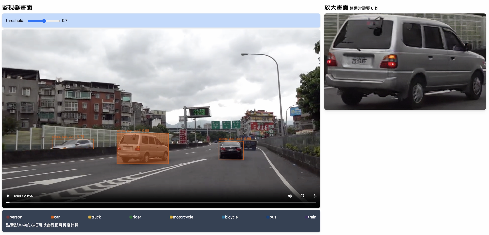

We provide web interface to test the model. You can use the following command to start the web server.

1. Put your street view video in `./www`, and rename it to `street_view.mp4`.

2. Start the backend server on a terminal

    ```bash
    $ cd yolov7
    $ python detect-web.py
    ```

3. Start the front-end on the other terminal

    ```bash
    $ cd www
    $ sh launch.sh
    ```

4. Go to http://localhost:30700/

## Train and evaluate the YOLOv7 model
1. You should `cd` to `yolov7` folder first
    
    ```bash
    $ cd yolov7
    ```

2. Train the model with cityscapes

    ```bash
    $ python -m torch.distributed.launch \
        --nproc_per_node 1 \
        --master_port 9527 \
        train.py \
        --workers 2 \
        --device 0 \
        --sync-bn \
        --epochs 100 \
        --batch-size 32 \
        --data data/cityscape.yaml \
        --img 640 640 \
        --cfg cfg/training/yolov7.yaml \
        --weights ./yolov7.pt \
        --hyp data/hyp.scratch.p5.yaml
    ```

    The output will be saved in `runs/train`.

    <details>
    <summary>Click to toggle contents of YOLOv7 Model Training Results</summary>

    <table align="center" width="100%" border="0">
        <tr>
            <td colspan="2" style="text-align:center; font-size:14px;"><b>Training & Evaluation Report<b></td>
        </tr>
        <tr>
            <td width="50%" style="text-align:center;font-size:14px;"><b>mAP@50: 0.61266<b></td>
            <td width="50%" style="text-align:center;font-size:14px;"><b>mAP@50:95 : 0.38005)<b></td>
        </tr>
        <tr>
            <td>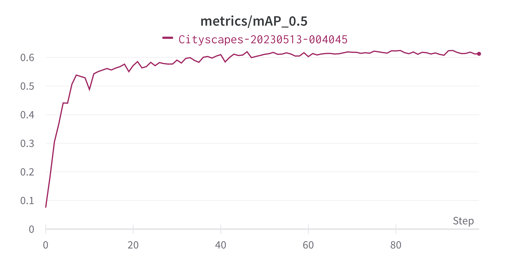</img></td>
            <td></img></td>
        </tr>
        <tr>
            <td colspan="3" width="33%" style="text-align:center;font-size:14px;"><b>Confusion Matrix<b></td>
        </tr>
        <tr>
            <td colspan="3">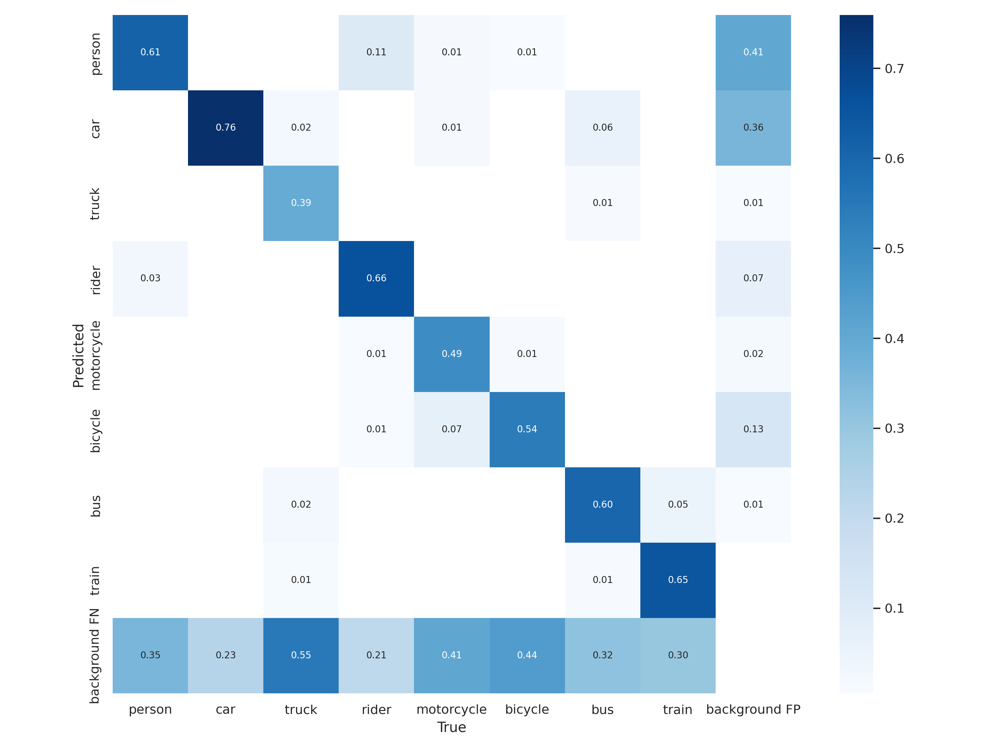</img></td>
        </tr>
        <tr>
            <td width="50%" style="text-align:center;font-size:14px;"><b>F1 curve<b></td>
            <td width="50%" style="text-align:center;font-size:14px;"><b>PR curve<b></td>
        </tr>
        <tr>
            <td>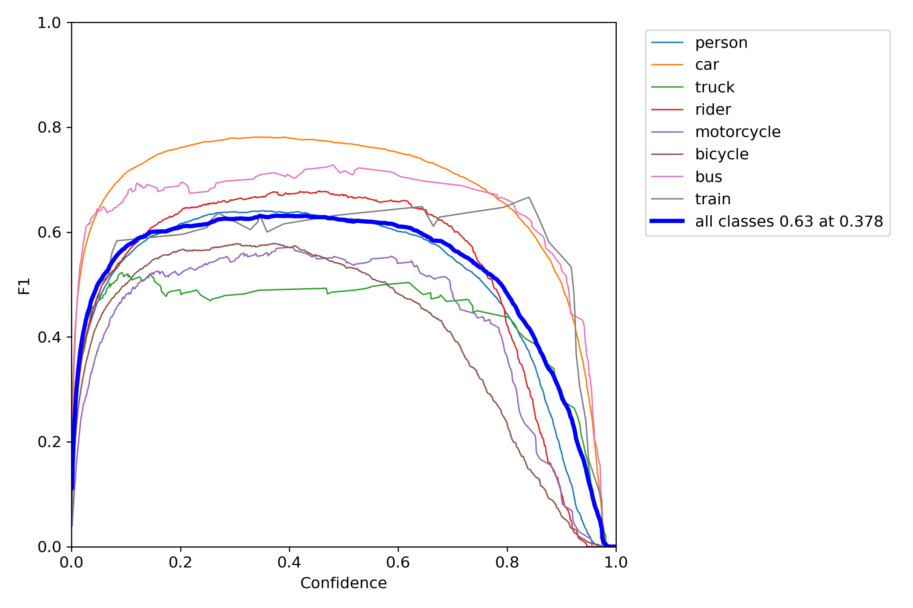</img></td>
            <td>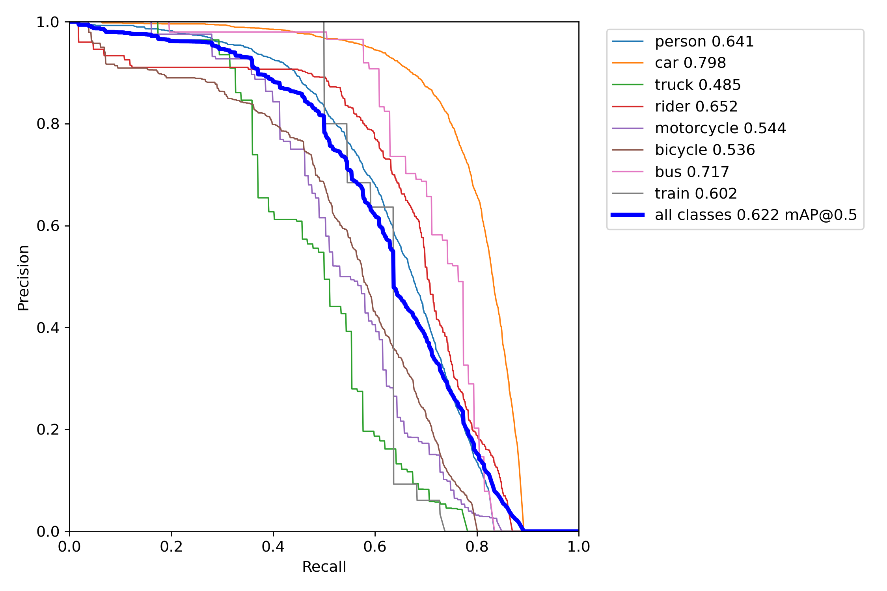</img></td>
        </tr>
        <tr>
            <td width="50%" style="text-align:center;font-size:14px;"><b>P curve<b></td>
            <td width="50%" style="text-align:center;font-size:14px;"><b>R curve<b></td>
        </tr>
        <tr>
            <td>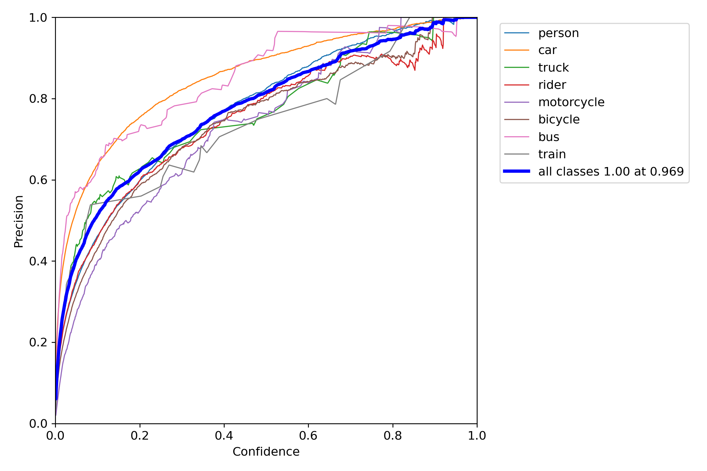</img></td>
            <td>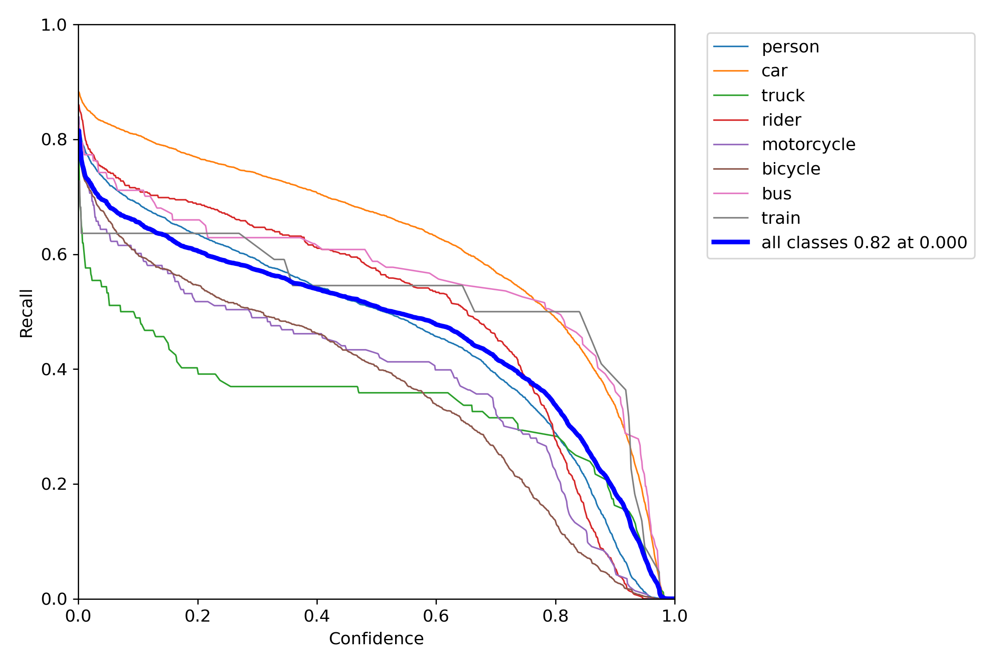</img></td>
        </tr>
    </table>
    </details>


3. Evaluation
    
    ```bash
    $ python test.py \
        --data data/cityscape.yaml \
        --img 640 \
        --batch 32 \
        --conf 0.001 \
        --iou 0.65 \
        --device 0 \
        --weights yolov7_cityscapes.pt \
        --name cityscapes_yolo_cityscapes
    ```
    
    The output will be saved in `runs/test`.

## Run inference

- On single image

    Only save the cropped region of width or height greater than 32px. Because if the region is too small, it will lead super resolution to generate the obvious artifact. The output will be saved in `runs/detect`.

    ```bash
    $ python detect.py \
        --weights yolov7_cityscapes.pt \
        --conf 0.25 \
        --img-size 640 \
        --source customdata/images/test/bonn/bonn_000004_000019_leftImg8bit.png \
        --sr
        --sr-step 100
    ```

    - `--sr`: Enable super resolution 4x.
    - `--sr-step`: Control the effect of super-resolution, the larger, the better.
    
    <br>
    
    <table align="center" border="0">
        <tr>
        <td colspan="4" style="text-align: center; font-size: 14px;"><b>Performance of Cropping & Super Resolution<b></td>
        </tr>
        <tr>
        <td width="25%" style="text-align: center; font-size: 14px;"><b>Crop<b></td>
        <td width="25%" style="text-align: center; font-size: 14px;"><b>Crop & SR 4x<b></td>
        <td width="25%" style="text-align: center; font-size: 14px;"><b>Crop<b></td>
        <td width="25%" style="text-align: center; font-size: 14px;"><b>Crop & SR 4x<b></td>
        </tr>
        <tr>
        <td width="25%">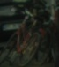</td>
        <td width="25%">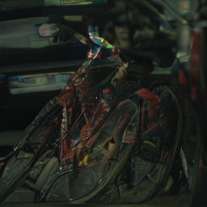</td>
        <td width="25%">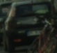</td>
        <td width="25%">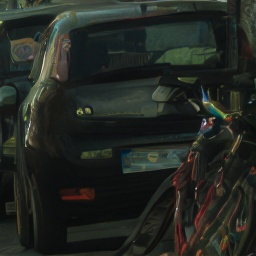</td>
        </tr>
        <tr>
        <td width="25%">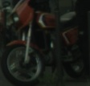</td>
        <td width="25%">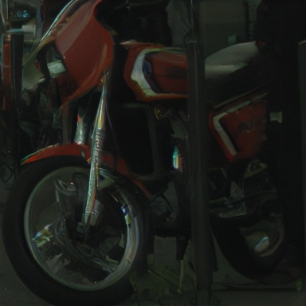</td>
        <td width="25%">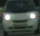</td>
        <td width="25%">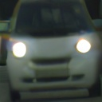</td>
        </tr>
    </table>
    
    If you want to test super resolution only, you can use `utils/custom_features.py` at `yolov7/` to do super resolution. If the width or height is larger than 150px, it will be resized to 150px and keep the aspect ratio first, then do super resolution.
    ```
    $ python utils/custom_features.py \
        --input-img inference/images/cropped_car.jpg \
        --sr-step 100
    ```

- On a video

    Nope, I haven't tried it yet.
